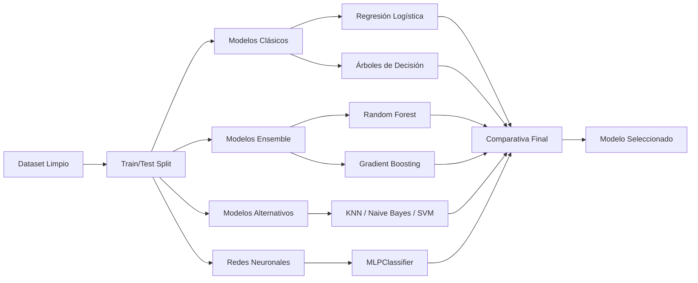

# 🏥 Predicción de Readmisión Hospitalaria en Pacientes Diabéticos

[](https://www.python.org/)
[](https://scikit-learn.org/)
[](https://pandas.pydata.org/)

## 📋 Descripción del Proyecto

Este proyecto aborda un **problema crítico de salud pública**: predecir qué pacientes diabéticos serán **readmitidos al hospital en menos de 30 días** tras su alta médica. La readmisión temprana representa tanto un riesgo para la salud del paciente como un costo significativo para el sistema sanitario.

Utilizando técnicas avanzadas de **Machine Learning y análisis de datos**, desarrollamos modelos predictivos que permiten identificar pacientes de alto riesgo, facilitando intervenciones preventivas y una mejor asignación de recursos hospitalarios.

---

## 🎯 Objetivos

### Objetivo Principal
Desarrollar y comparar múltiples modelos de clasificación para predecir la readmisión hospitalaria en menos de 30 días con la mayor precisión posible.

### Objetivos Específicos
- 🔍 Realizar un análisis exploratorio exhaustivo del comportamiento de readmisiones
- 🧹 Implementar técnicas robustas de limpieza y transformación de datos
- 🤖 Entrenar y evaluar 6+ algoritmos de clasificación diferentes
- 📊 Comparar modelos basándose en métricas clínicas relevantes
- 💡 Identificar los factores de riesgo más importantes para la readmisión
- ⚖️ Analizar trade-offs entre interpretabilidad y rendimiento

---

## 📊 Dataset

**Fuente:** [Diabetes 130-US Hospitals (1999-2008) - UCI ML Repository](https://archive.ics.uci.edu/ml/datasets/diabetes+130-us+hospitals+for+years+1999-2008)

### Características del Dataset
- **Instancias:** 101,766 registros hospitalarios
- **Features:** 50+ variables (demográficas, clínicas, medicamentos, diagnósticos)
- **Período:** 10 años de datos (1999-2008)
- **Hospitales:** 130 instituciones de EE.UU.

### Variables Clave
- **Demográficas:** Edad, género, raza
- **Clínicas:** Tiempo de hospitalización, número de procedimientos, diagnósticos
- **Medicamentos:** Cantidad de medicamentos, cambios en medicación, uso de insulina
- **Resultados de laboratorio:** HbA1c, glucosa en sangre
- **Variable objetivo:** Readmisión (`<30 días`, `>30 días`, `No`)

---

## 🛠️ Metodología

### 1️⃣ Análisis Exploratorio y Preparación de Datos
**Responsable:** Albert

**Actividades:**
- ✅ Carga e inspección inicial del dataset
- ✅ Análisis de valores faltantes y duplicados
- ✅ Operaciones vectorizadas con NumPy (optimización de rendimiento)
- ✅ Limpieza y transformación de variables
- ✅ Feature Engineering (creación de nuevas variables relevantes)
- ✅ Encoding de variables categóricas
- ✅ Normalización y estandarización
- ✅ Análisis de correlaciones y agregaciones con Pandas
- ✅ Visualizaciones exploratorias (distribuciones, heatmaps, boxplots)

**Entregables:**
- Dataset limpio (`diabetes_clean.csv`)
- Notebook de EDA con insights clave
- Visualizaciones de alta calidad

---

### 2️⃣ Modelos Clásicos de Clasificación
**Responsable:** Robert

**Modelos Implementados:**

#### 🔹 Regresión Logística (Baseline)
- Modelo de referencia para comparación
- Análisis de coeficientes e importancia de features
- Experimentación con umbrales de decisión
- Curva ROC y AUC

#### 🔹 Árboles de Decisión
- Visualización del árbol de decisión
- Diagnóstico de overfitting
- Optimización de hiperparámetros (`max_depth`, `min_samples_leaf`)
- Curvas de aprendizaje

#### 🔹 Validación y Optimización
- Validación Cruzada (K-Fold)
- GridSearchCV para búsqueda de hiperparámetros óptimos
- Comparativa de modelos clásicos

**Entregables:**
- Modelos entrenados y optimizados
- Matrices de confusión
- Análisis de trade-offs precision vs recall
- Tabla comparativa de rendimiento

---

### 3️⃣ Modelos Avanzados y Ensembles
**Responsable:** Linda

**Modelos Implementados:**

#### 🔸 Random Forest (Bagging)
- Ensemble de múltiples árboles independientes
- Análisis de importancia de features
- Optimización de hiperparámetros

#### 🔸 Gradient Boosting (Boosting)
- Árboles secuenciales que corrigen errores previos
- Comparación con Random Forest
- Ajuste de learning rate y número de estimadores

#### 🔸 Modelos Alternativos (2 de 3)
- **K-Nearest Neighbors (KNN):** Clasificación basada en vecinos cercanos
- **Naive Bayes:** Modelo probabilístico rápido
- **Support Vector Machine (SVM):** Clasificación con hiperplanos óptimos

#### 🔸 Redes Neuronales (MLPClassifier)
- Perceptrón multicapa con capas ocultas
- Comparación con modelos tradicionales
- Análisis crítico: ¿cuándo usar redes neuronales?

**Entregables:**
- Todos los modelos entrenados y evaluados
- Diagramas explicativos (Bagging vs Boosting)
- Comparativa completa de 6+ modelos
- Modelo final seleccionado y justificado
- Recomendaciones para producción

---

## 📈 Métricas de Evaluación

Dado el contexto clínico, priorizamos métricas que reflejen el costo real de los errores:

| Métrica | Descripción | Relevancia |
|---------|-------------|------------|
| **Recall** | Capacidad de detectar readmisiones reales | ⭐⭐⭐ Crítico: Un falso negativo = paciente en riesgo no detectado |
| **F1-Score** | Balance entre precisión y recall | ⭐⭐⭐ Importante: Métrica equilibrada para datos desbalanceados |
| **ROC-AUC** | Área bajo la curva ROC | ⭐⭐ Buena medida general de discriminación |
| **Precision** | Porcentaje de predicciones positivas correctas | ⭐⭐ Relevante: Recursos mal asignados |
| **Accuracy** | Aciertos totales | ⭐ Puede ser engañosa con clases desbalanceadas |

### Contexto de Negocio
- **Falso Negativo (FN):** Paciente readmitido no detectado → Riesgo de salud + Costo de emergencia
- **Falso Positivo (FP):** Falsa alarma → Recursos preventivos mal asignados

**Conclusión:** Priorizamos **Recall** y **F1-Score** para minimizar FN.

---

## 🔍 Modelos de Machine Learning Evaluados



### Comparativa de Filosofías

| Modelo | Tipo | Interpretabilidad | Velocidad | Rendimiento Esperado |
|--------|------|-------------------|-----------|---------------------|
| Regresión Logística | Lineal | ⭐⭐⭐⭐⭐ | ⚡⚡⚡⚡⚡ | Baseline |
| Árbol de Decisión | No lineal | ⭐⭐⭐⭐ | ⚡⚡⚡⚡ | Medio |
| Random Forest | Ensemble (Bagging) | ⭐⭐⭐ | ⚡⚡⚡ | Alto |
| Gradient Boosting | Ensemble (Boosting) | ⭐⭐ | ⚡⚡ | Muy Alto |
| KNN | Instance-based | ⭐⭐ | ⚡ | Variable |
| Naive Bayes | Probabilístico | ⭐⭐⭐ | ⚡⚡⚡⚡⚡ | Medio-Bajo |
| SVM | Kernel-based | ⭐⭐ | ⚡⚡ | Alto |
| MLP | Deep Learning | ⭐ | ⚡⚡ | Alto (datos tabulares) |

---

## 🚀 Tecnologías y Herramientas

### Lenguajes y Frameworks
- **Python 3.8+** - Lenguaje principal
- **Jupyter Notebook** - Entorno de desarrollo interactivo

### Librerías de Análisis de Datos
- **NumPy** - Operaciones vectorizadas y computación numérica
- **Pandas** - Manipulación y análisis de datos tabulares
- **Matplotlib / Seaborn** - Visualización de datos

### Librerías de Machine Learning
- **scikit-learn** - Algoritmos de ML, preprocesamiento, métricas
  - `LogisticRegression`
  - `DecisionTreeClassifier`
  - `RandomForestClassifier`
  - `GradientBoostingClassifier`
  - `KNeighborsClassifier`
  - `GaussianNB`
  - `SVC`
  - `MLPClassifier`
- **imbalanced-learn** (opcional) - Manejo de clases desbalanceadas

### Herramientas de Desarrollo
- **Git/GitHub** - Control de versiones
- **VS Code** - Editor de código

---

## ⚙️ Instalación y Uso

### 1. Clonar el repositorio
```bash
git clone https://github.com/thisisrober/diabetes-clasification.git
cd diabetes-clasification
```

### 2. Crear entorno virtual (recomendado)
```bash
python -m venv venv
.\venv\Scripts\activate  # Windows
source venv/bin/activate  # Linux/Mac
```

### 3. Instalar dependencias
```bash
pip install -r requirements.txt
```

### 4. Ejecutar notebooks
```bash
jupyter notebook
```

Abrir los notebooks en orden:
1. `01_EDA_Preprocessing.ipynb`
2. `02_Classical_Models.ipynb`
3. `03_Advanced_Models.ipynb`

---

## 📊 Resultados Esperados

### Insights Clave del EDA
- Identificación de grupos de alto riesgo (edad, condiciones previas)
- Relación entre cantidad de medicamentos y readmisión
- Impacto de HbA1c en resultados clínicos
- Desbalance de clases en variable objetivo

### Comparativa de Modelos
Tabla final comparando todos los modelos en:
- **Accuracy, Precision, Recall, F1-Score, ROC-AUC**
- **Tiempo de entrenamiento**
- **Interpretabilidad**
- **Trade-offs y recomendaciones**

### Modelo Final
- Justificación técnica y de negocio
- Features más importantes
- Recomendaciones para implementación en producción
- Próximos pasos y mejoras futuras

---

## 👥 Equipo de Desarrollo

| Integrante | Rol | Responsabilidad |
|------------|-----|-----------------|
| **Albert** | Data Analyst | Análisis exploratorio y preparación de datos |
| **Robert** | ML Engineer | Modelos clásicos y optimización |
| **Linda** | ML Researcher | Modelos avanzados y comparativa final |

---

## 📝 Licencia

Este proyecto es parte de un trabajo académico para el curso de **Data Analysis with Python** en el programa **BigData+**.

---

## 🔗 Referencias

- [UCI Machine Learning Repository - Diabetes Dataset](https://archive.ics.uci.edu/ml/datasets/diabetes+130-us+hospitals+for+years+1999-2008)
- [scikit-learn Documentation](https://scikit-learn.org/stable/documentation.html)
- Strack, B., et al. (2014). "Impact of HbA1c Measurement on Hospital Readmission Rates: Analysis of 70,000 Clinical Database Patient Records"
